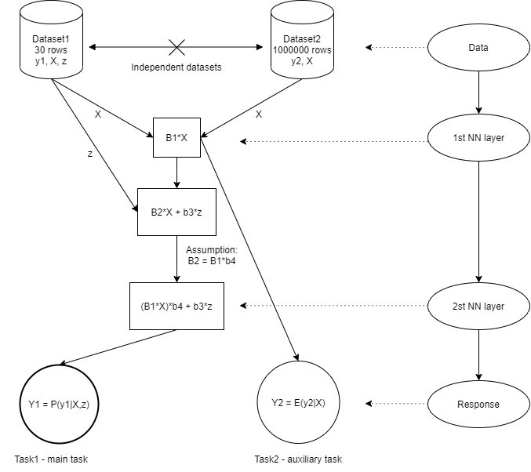

## Task:
Create a model which solves task1 and task2 simultaneously using NN. The definition tasks are provided below. The schema of the model is also added.

Task1 is the main task with Dataset1 containing y1 (response variable) and X, z (explanatory variables), but only 30 rows of data is available. The relation between response and explanatory variables is linear: B2 * X + b3 * z. The model should estimate P(y1|X, z). We have logistic regression problem: Logit(P(y1|X, z)) = B2*X+b3*z.
Task2 is auxiliary task with Dataset2 containing y2 (response variable) and X (explanatory variables) and 1 million rows of data is available. The relation between response and explanatory variables is linear:  y2 = B1 * X. The model should estimate E(y2|X) – linear regression.

## Assumptions:
Dataset1 and Dataset2 are independent.
X variables have similar effect on y1 and y2, the only difference is how strongly the X linear combination affects y1 and y2 which means that B2 = B1 * b4.
The model is a 2 layers NN where the 1st layer is shared (the same) for both tasks. Please note, z variable is only included in the 2nd layer.

## Requirements:
The model should be single (NN).
The model for both tasks should be trained simultaneously (all parameters: B1, b3, b4 should be estimated simultaneously; one training with back propagation).
Tasks should share some part of the same architecture (B1 * X part is the same for both tasks).
No workarounds are allowed (for example: training first step, fixing it and then training the second step).
The solution should be universal and be able to solve multi-task learning problem with any 2 independent datasets and 2 different responses with a shared part of architecture (B1 * X at this case, but it should be easy to adjust which part of the architecture is shared).
Loss function should be joint for both tasks (using keras/tensorflow framework).
The code should be neat and organized with docstrings.
The code should be commented and pushed to github.

## Hints:
Multitask learning.
Masking for not including NA’s values when it is not NA.

 

